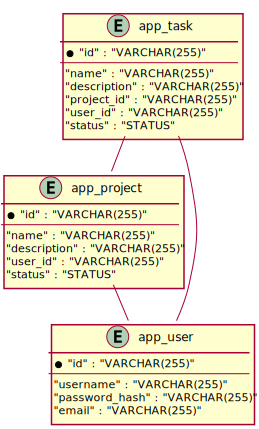

= Task Manager
:toc-title: Оглавление
:toc:

== Представление данных

=== ER-диаграмма базы данных 

 

=== Сущность "app_project"

==== Общие сведения

[cols="20,80"]
|===

|*Физ. название*:
|app_project

|*Лог. название*:
|Проект

|*Сервис*:
|Task Manager

|*База данных*:
|

|*Доп. сведения*:
|Postgres 15

|*Схема*:
|

|===

==== Описание полей

[cols="0,20,20,20,5,5,5,5,5,10"]
|===

^|*№*
|*Физ. название*
|*Тип*
|*Лог. название*
^|*PK*
^|*UK*
^|*FK*
^|*AI*
^|*NN*
|*DEFAULT*

^|01. 
|id
|VARCHAR(255)
|Идентификатор
^|✓
^|--
^|--
^|--
^|--
|

^|02. 
|name
|VARCHAR(255)
|Название
^|--
^|--
^|--
^|--
^|✓
|

^|03. 
|description
|VARCHAR(255)
|Описание
^|--
^|--
^|--
^|--
^|✓
|

^|04. 
|user_id
|VARCHAR(255)
|Идентификатор пользователя
^|--
^|--
^|✓
^|--
^|--
|

^|05. 
|status
|STATUS
|Статус
^|--
^|--
^|--
^|--
^|✓
|NOT_STARTED

|===

=== Сущность "app_task"

==== Общие сведения

[cols="20,80"]
|===

|*Физ. название*:
|app_task

|*Лог. название*:
|Задача

|*Сервис*:
|Task Manager

|*База данных*:
|

|*Доп. сведения*:
|Postgres 15

|*Схема*:
|

|===

==== Описание полей

[cols="0,20,20,20,5,5,5,5,5,10"]
|===

^|*№*
|*Физ. название*
|*Тип*
|*Лог. название*
^|*PK*
^|*UK*
^|*FK*
^|*AI*
^|*NN*
|*DEFAULT*

^|01. 
|id
|VARCHAR(255)
|Идентификатор
^|✓
^|--
^|--
^|--
^|--
|

^|02. 
|name
|VARCHAR(255)
|Название
^|--
^|--
^|--
^|--
^|✓
|

^|03. 
|description
|VARCHAR(255)
|Описание
^|--
^|--
^|--
^|--
^|✓
|

^|04. 
|project_id
|VARCHAR(255)
|Идентификатор проекта
^|--
^|✓
^|✓
^|--
^|--
|

^|05. 
|user_id
|VARCHAR(255)
|Идентификатор пользователя
^|--
^|--
^|✓
^|--
^|--
|

^|06. 
|status
|STATUS
|Статус
^|--
^|--
^|--
^|--
^|✓
|NOT_STARTED

|===

=== Сущность "app_user"

==== Общие сведения

[cols="20,80"]
|===

|*Физ. название*:
|app_user

|*Лог. название*:
|Пользователь

|*Сервис*:
|Task Manager

|*База данных*:
|

|*Доп. сведения*:
|Postgres 15

|*Схема*:
|

|===

==== Описание полей

[cols="0,20,20,20,5,5,5,5,5,10"]
|===

^|*№*
|*Физ. название*
|*Тип*
|*Лог. название*
^|*PK*
^|*UK*
^|*FK*
^|*AI*
^|*NN*
|*DEFAULT*

^|01. 
|id
|VARCHAR(255)
|
^|✓
^|--
^|--
^|--
^|--
|

^|02. 
|username
|VARCHAR(255)
|Имя пользователя
^|--
^|✓
^|--
^|--
^|✓
|

^|03. 
|password_hash
|VARCHAR(255)
|Хеш пароля
^|--
^|--
^|--
^|--
^|✓
|

^|04. 
|email
|VARCHAR(255)
|E-mail
^|--
^|✓
^|--
^|--
^|✓
|

|===

