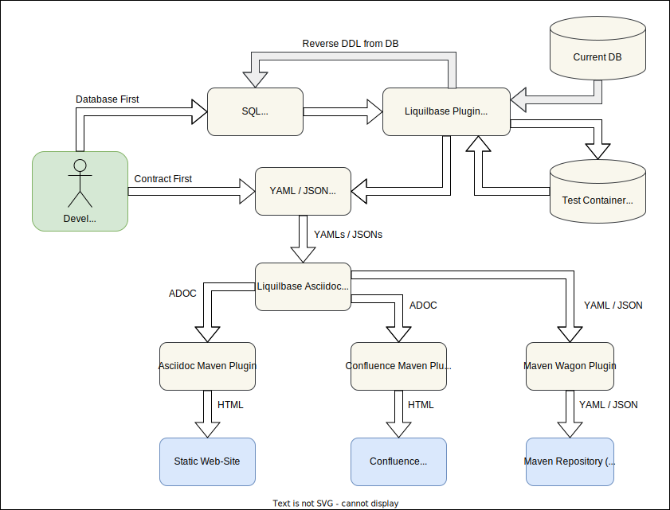
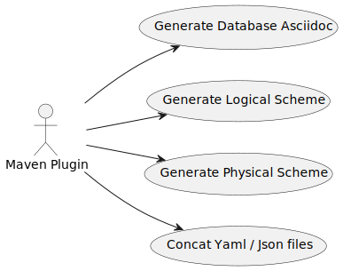

= liquilbase-asciidoc-maven-plugin
:toc:

== Project Info

[cols="20,80"]
|===

|*Version*
|1.0.0

|*Java*
|OpenJDK 8

|*Maven*
|3.6.3

|===

== Developer Info

[cols="20,80"]
|===

|*Name*
|Denis Volnenko

|*E-mail*
|denis@volnenko.ru

|===

== Context View

== Use-Cases

== Technical Limitations

=== Unsupported composite keys (PK, FK, UK)

=== Liquibase Maven Plugin has problem with long YAML scheme

== Examples

[cols="20,80"]
|===

|task-manager-database-asciidoc
|https://github.com/denis-volnenko/liquilbase-asciidoc-maven-plugin/blob/master/example/task-manager-database-asciidoc/src/main/asciidoc/index.adoc

|task-manager-sql-to-asciidoc
|https://github.com/denis-volnenko/liquilbase-asciidoc-maven-plugin/blob/master/example/task-manager-sql-to-asciidoc/src/main/asciidoc/index.adoc

|===

== Volnenko Maven Plugins

[cols="20,80"]
|===

|*Liquilbase*
a|
https://github.com/denis-volnenko/liquilbase-asciidoc-maven-plugin/
https://maven.volnenko.ru/sites/liquilbase-asciidoc-maven-plugin/

|*OpenApi*
a|
https://github.com/denis-volnenko/openapi-asciidoc-maven-plugin/
https://maven.volnenko.ru/sites/openapi-asciidoc-maven-plugin/

|*Minio Wagon*
a|
https://github.com/denis-volnenko/minio-wagon-maven-plugin/
https://maven.volnenko.ru/sites/minio-wagon-maven-plugin/

|===

== Plugin configuration

=== Repository config

----
<?xml version="1.0" encoding="UTF-8"?>
<project ...>

    <repositories>
        <repository>
            <id>maven.volnenko.ru</id>
            <name>maven.volnenko.ru</name>
            <url>https://maven.volnenko.ru/repository</url>
            <releases>
                <enabled>true</enabled>
            </releases>
            <snapshots>
                <enabled>true</enabled>
            </snapshots>
        </repository>
    </repositories>

</project>
----

=== Config example

----
<?xml version="1.0" encoding="UTF-8"?>
<project ...>

    <build>
        <plugins>
            <plugin>
                <groupId>ru.volnenko.maven.plugin</groupId>
                <artifactId>liquilbase-asciidoc-maven-plugin</artifactId>
                <version>1.0.0</version>
                <configuration>
                    <serviceName>TaskManager</serviceName>
                    <dataBaseInfo>Postgres 15</dataBaseInfo>
                    <headerFirstEnabled>true</headerFirstEnabled>
                    <headerSecondEnabled>true</headerSecondEnabled>
                    <tableOfContentsEnabled>true</tableOfContentsEnabled>
                    <outputPath>${project.basedir}/doc/</outputPath>
                    <outputJsonFileEnabled>true</outputJsonFileEnabled>
                    <outputYamlFileEnabled>true</outputYamlFileEnabled>
                    <files>
                        <file>${project.basedir}/erd/project.yaml</file>
                        <file>${project.basedir}/erd/task.yaml</file>
                        <file>${project.basedir}/erd/status.yaml</file>
                    </files>
                </configuration>
            </plugin>
        </plugins>
    </build>

</project>
----

== Development

=== Build maven plugin

----
mvn clean install
----

=== Generate documentation

----
mvn liquilbase-asciidoc:generate
----